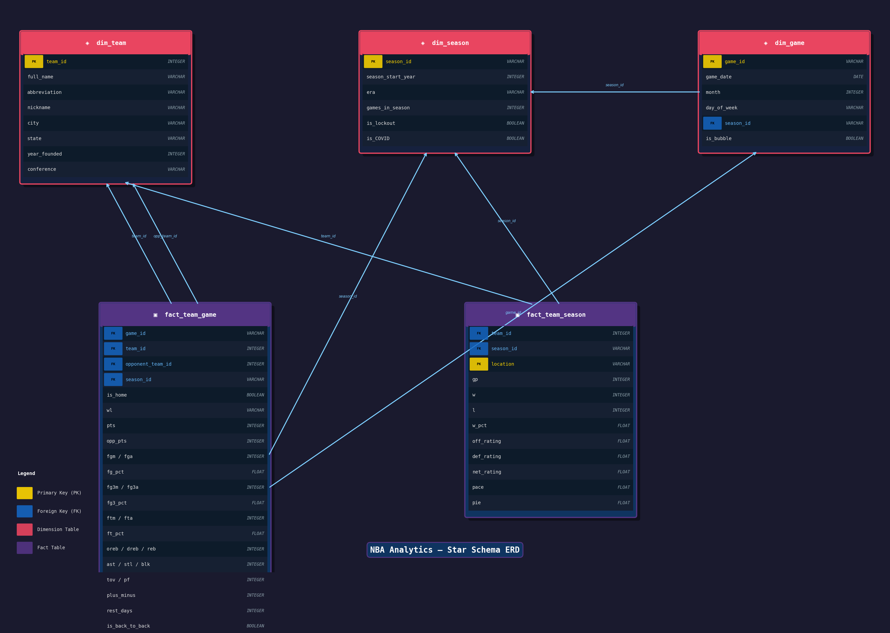

# NBA Analytics Data Platform
 
> **Is home court advantage real?**
> How do scheduling factors like back-to-backs, the COVID bubble, conference travel burdens, and referee tendencies shape the home/away performance gap?
 
---
 
## Table of Contents
 
1. [Project Overview](#1-project-overview)
2. [Data Sources](#2-data-sources)
3. [Schema Design](#3-schema-design)
4. [Pipeline Architecture](#4-pipeline-architecture)
5. [CSV vs. Parquet Comparison](#5-csv-vs-parquet-comparison)
6. [Known Limitations](#6-known-limitations)

## 1. Project Overview
 
This project builds an end-to-end NBA analytics data platform to investigate one of basketball's most debated questions: **is home court advantage real, and is it disappearing?**
 
The analysis spans **29 seasons (1996-97 through 2024-25)** — covering every major scheduling inflection point in modern NBA history, including the 2017-18 back-to-back reduction overhaul, reducion in long road trips, the 2019-20 COVID bubble (a natural experiment with no fans, no travel, and neutral courts), the compressed 2020-21 season, and the 2023-24 introduction of the NBA Cup and stricter player participation policies.
 
The platform pulls raw data from the `nba_api` Python package, lands it as JSON, loads it into staging tables in DuckDB, and transforms it into a Kimball-style star schema. Ten SQL queries answer specific analytical questions about home/away performance gaps. Results are exported to Parquet and optionally uploaded to S3.
 
> **Key findings will be added upon completion of analysis.**

### Analytical Angles
 
| Theme | Question |
|---|---|
| Baseline | Does a measurable home win% advantage exist across all 29 seasons? |
| Trend | Is the magnitude of that advantage shrinking over time? |
| COVID Bubble | What happened to home advantage with no fans and no travel? |
| Back-to-Backs | Does fatigue override the home advantage? |
| Shooting | Do teams shoot measurably better at home? |
| Rolling Performance | When in the season does home advantage peak? |
| Referee Influence | Do home teams get more free throw attempts? |
| Conference | Is the advantage stronger in the West due to travel burden? |
| Opponent Strength | Does home advantage shrink against elite opponents? |
| Turnovers | Do teams turn the ball over less at home? |

## 2. Data Sources
 
All data is sourced from [`nba_api`](https://github.com/swar/nba_api), a free Python package with no API key required.

## 3. Schema Design
 
The schema follows Kimball dimensional modeling principles, implemented in **DuckDB**.
 
### Why DuckDB?
 
DuckDB is an in-process analytical database optimized for OLAP workloads. It natively reads
JSON and writes Parquet and supports the full suite of SQL window functions used in the analysis.

SQLite was the alternative, but DuckDB outperforms it due to vectorized execution. Rather than 
processing one row at a time, DuckDB processes data in batches (vectors) of thousands of rows 
simultaneously, taking advantage of modern CPU cache and SIMD instructions.



## 4. Pipeline Architecture
 
The pipeline follows a three-stage structure: **Extract → Load → Transform**, with Parquet export as the final output. A single entry point (`main()` in `run.py`) orchestrates all phases and logs the duration of each.
 
```
nba_api (Python)
     │
     │  HTTP calls (LeagueGameFinder, LeagueDashTeamStats)
     │  In-memory (static.teams)
     ▼
JSON Files  (/data/game_logs/, /data/team_stats/, /data/team_static/)
     │
     │  
     ▼
DuckDB Staging Tables
  staging_game_log_data
  staging_team_stats_base
  staging_team_stats_advanced
  staging_teams_data
     │
     │  
     ▼
DuckDB Star Schema
  dim_team
  dim_season
  dim_game
  fact_team_game
  fact_team_season
     │
     │  COPY TO / DataFrame export → .parquet
     ▼
Parquet Files  (/data/parquet/)
     │
     │  boto3 
     ▼
S3 Bucket
```

## 5. CSV vs. Parquet Comparison

**Columnar storage** — Parquet stores data column by column rather than row by row.
For analytical queries that only read a few columns (e.g. `SELECT AVG(fta) WHERE is_home = true`),
Parquet skips entire columns it doesn't need, dramatically reducing I/O. CSV always reads every
field in every row, even the ones your query ignores.

**Compression** — Because each column contains values of the same type, Parquet can apply
highly efficient encoding schemes like dictionary encoding for low-cardinality columns
(e.g. `wl` is just `'W'` or `'L'`, `conference` is just `'East'` or `'West'`) and
run-length encoding for repeated values. CSV stores everything as plain text with no compression.

**Schema enforcement** — Parquet embeds the schema (column names, data types, nullability)
directly in the file. This means a downstream consumer always knows what it's reading without
relying on a separate data dictionary or manual inspection. CSV has no type information —
every value is a string until something else interprets it, which creates type mismatch bugs
at load time.

## 6. Known Limitations
Datasets and data model doesn't account for teams that moved to new cities or expansion teams since 1996. Given more time, this would be address with a slowly-changing dimension.

Here are all the relocations and major name changes since 1996:
1. Vancouver Grizzlies → Memphis Grizzlies (2001) — relocated from Canada to Tennessee.
2. Charlotte Hornets → New Orleans Hornets (2002) — the franchise moved to New Orleans, and Charlotte later got an expansion team (Bobcats in 2004) that reclaimed the Hornets name in 2014.
3. New Orleans Hornets → New Orleans/Oklahoma City Hornets (2005-07) — temporarily displaced to OKC after Hurricane Katrina, then returned to New Orleans full-time in 2007.
4. Seattle SuperSonics → Oklahoma City Thunder (2008) — full relocation, new city, new name, new arena.
5. New Jersey Nets → Brooklyn Nets (2012) — moved from East Rutherford, NJ to Brooklyn, NY.


